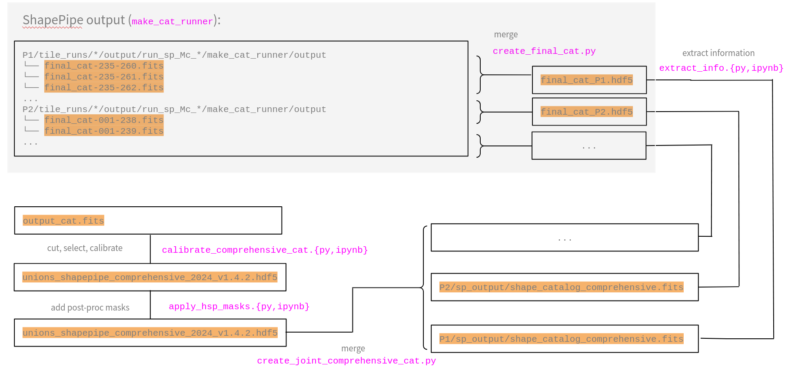

sp_validation
=============

.. Include table of contents (defines the left-sidebar navigation)
.. include:: toc.rst

``sp_validation`` validates the weak-lensing catalogues that the
`ShapePipe <https://github.com/CosmoStat/shapepipe>`_ pipeline produces: galaxy
and star shapes, and the many quantities derived from them.
The `CosmoStat <https://www.cosmostat.org>`_ lab at CEA Paris-Saclay develops it
to prepare and vet the shear catalogues behind the `UNIONS
<https://www.skysurvey.cc>`_ cosmic-shear analyses.

The package bundles a Python library with the scripts and notebooks that drive a
validation campaign.
Together they carry a raw ShapePipe catalogue through to the calibrated,
science-ready shear catalogue and the diagnostics a cosmology analysis depends
on.

What it does
------------

Four main tasks make up a run, usually in sequence:

#. **Shear validation.** Take a shear catalogue carrying metacalibration
   information, apply the shear calibration, and run diagnostic tests such as
   PSF leakage. The output is a calibrated shear catalogue. See
   :doc:`run_validation`.
#. **Post-processing.** Turn the calibrated catalogue into science-ready
   catalogues: masking, galaxy-sample selection, and merging of per-patch
   catalogues. See :doc:`post_processing`.
#. **Cosmology validation.** Run detailed diagnostics on the calibrated
   catalogue: rho- and tau-statistics, E-/B-mode decomposition, and comparison
   plots across catalogue versions.
#. **Cosmology inference.** Measure the two-point shear correlation functions
   and feed a CosmoSIS / CosmoCov pipeline to derive cosmological constraints.

The flow chart below illustrates the path from ShapePipe output products to
calibrated, well-selected galaxy catalogues.

   From ShapePipe output products to calibrated and selected galaxy catalogues.

Where to go next
----------------

- :doc:`installation` — install via container (recommended) or a development
  checkout.
- :doc:`quickstart` — an orientation to the four stages of a validation run.
- :doc:`about` — the package in its CosmoStat / UNIONS context, with authors and
  contact.
- :doc:`repository_structure` — how the tree is laid out and where each kind of
  work belongs.
- The **User Guide** in the sidebar walks through each stage: :doc:`using the
  released catalogues <using_the_catalogues>`, running shear validation,
  post-processing, and the PSF-leakage diagnostics.
- The **API Reference** documents every module of the ``sp_validation`` library.
